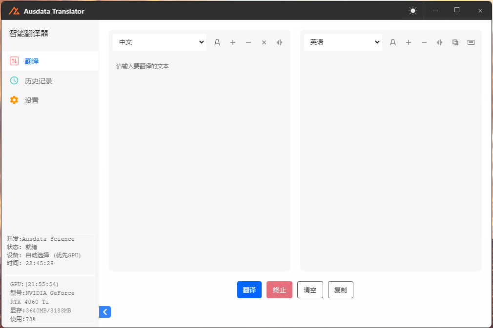
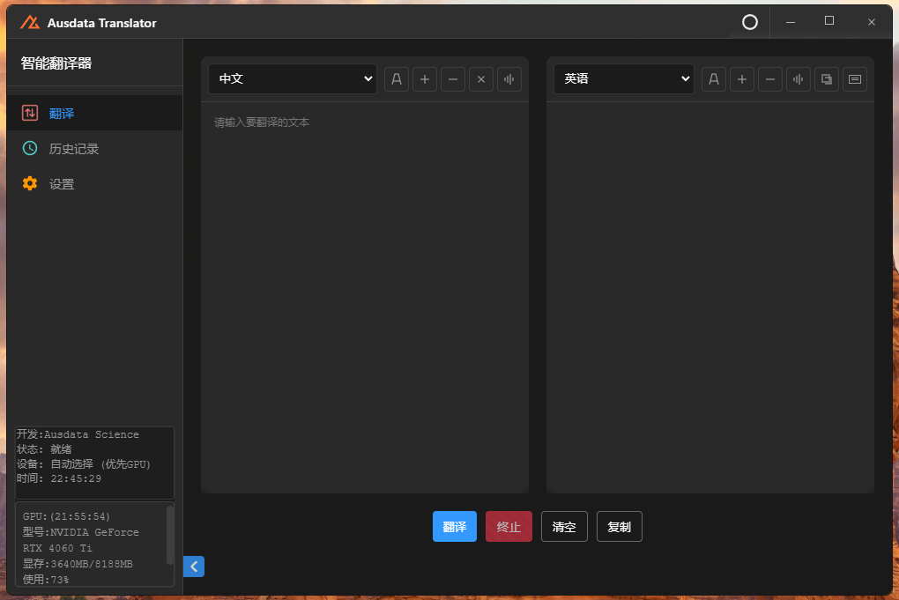
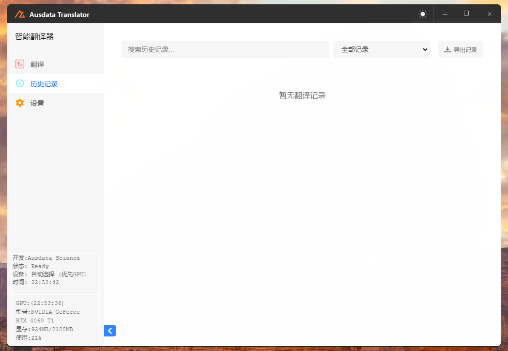
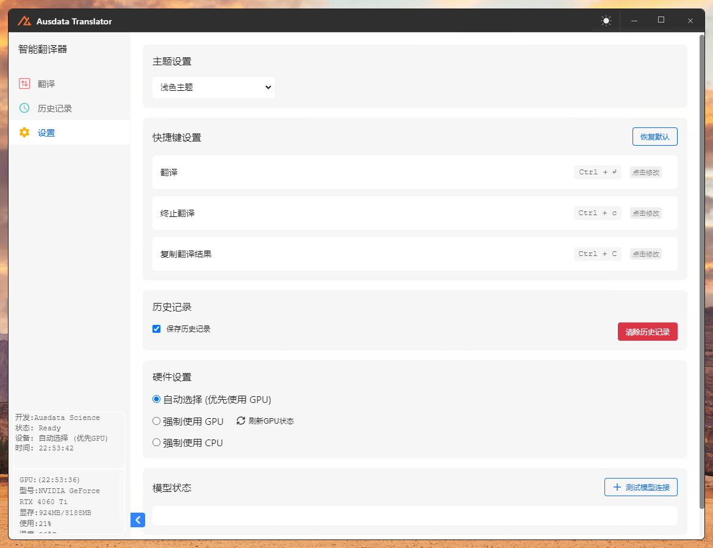

# Ausdata Translator | 智能翻译

[English](#english) | [中文](#chinese)

# <a name="english">English</a>

A cross-platform translation software based on Electron and NLLB-200.

## Screenshots

<div align="center">
  
  <p><em>Main Interface - Light Theme</em></p>
</div>

<div align="center">
  
  <p><em>Main Interface - Dark Theme</em></p>
</div>

## Features

- Multi-language translation support (Chinese, English, Japanese)
- Automatic language detection
- GPU acceleration support
- Translation history management
- Dark/Light theme
- Export to PDF/Word
- Offline operation, privacy protection

## System Requirements

- Windows 10/11 64-bit
- 8GB+ RAM
- Python 3.8 or higher
- Node.js 14 or higher
- (Optional) NVIDIA GPU with CUDA support

## Installation

1. Clone repository
```bash
git clone https://github.com/Ausdatascience/Ausdata_Translator.git
cd /Ausdata_Translator
```

2. Install Python dependencies
```bash
pip install -r requirements.txt
```

3. Install Node.js dependencies
```bash
npm install
```

4. Download models (first time only)
```bash
python download_models.py
```

5. Start application
```bash
npm start
```

## 🛠️ Development

### Tech Stack
- Electron
- React
- NLLB-200 Translation Model
- Python Backend

### Project Structure
```
├── src/                    # Source code
│ ├── assets/              # Icons and resources
│ ├── styles/              # CSS files
│ ├── js/                  # JavaScript files
│ └── index.html          # Main interface
├── inference_service.py   # Python translation service
├── main.js               # Electron main process
└── package.json          # Project configuration
```

## 📄 License

[MIT License](LICENSE)

## 📮 Contact

- Email: ausdata.app@gmail.com
- Website: https://www.ausdatascience.com

---

# <a name="chinese">中文</a>

一个基于 Electron 和 NLLB-200 的跨平台翻译软件。

## 功能特点

- 支持中文、英语、日语等多语言互译
- 自动语言检测
- GPU 加速支持
- 历史记录管理
- 深色/浅色主题
- 导出为 PDF/Word
- 离线运行，保护隐私

## 系统要求

- Windows 10/11 64位
- 8GB 以上内存
- Python 3.8 或更高版本
- Node.js 14 或更高版本
- （可选）NVIDIA GPU 支持 CUDA

## 安装步骤

1. 克隆仓库
```bash
git clone https://github.com/Ausdatascience/Ausdata_Translator.git
cd Ausdata_Translator
```

2. 安装 Python 依赖
```bash
pip install -r requirements.txt
```

3. 安装 Node.js 依赖
```bash
npm install
```

4. 下载模型（首次运行需要）
```bash
python download_models.py
```

5. 启动应用
```bash
npm start
```

## 🛠️ 开发相关

### 技术栈
- Electron
- React
- NLLB-200 翻译模型
- Python 后端

### 目录结构
```
├── src/                    # 源代码目录
│ ├── assets/              # 图标和资源文件
│ ├── styles/              # CSS 样式文件
│ ├── js/                  # JavaScript 文件
│ └── index.html          # 主界面
├── inference_service.py   # Python 翻译服务
├── main.js               # Electron 主进程
└── package.json          # 项目配置文件
```

## 📄 许可证

[MIT License](LICENSE)

## 📮 联系方式

- 邮箱：ausdata.app@gmail.com
- 网站：https://www.ausdatascience.com

## 界面预览

### 主界面 (浅色主题)


### 主界面 (深色主题)


### 历史记录


### 设置页面
